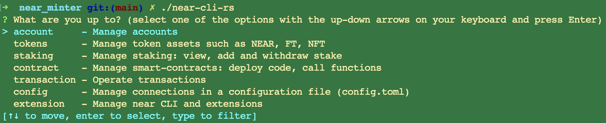
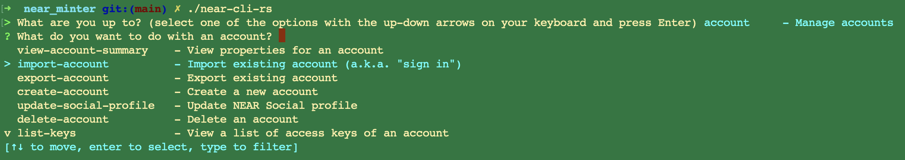
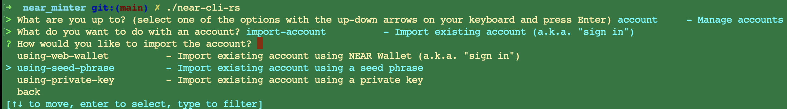
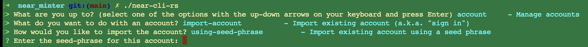
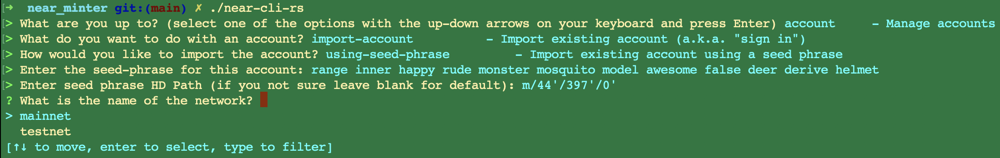
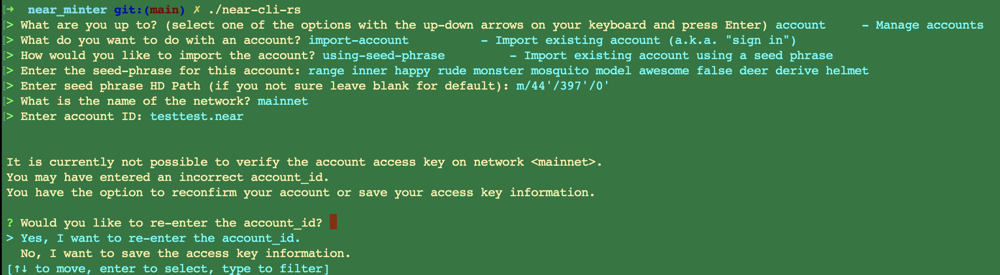
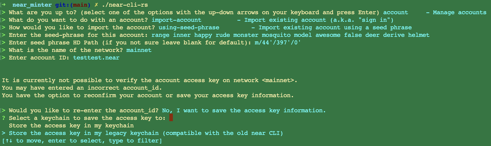
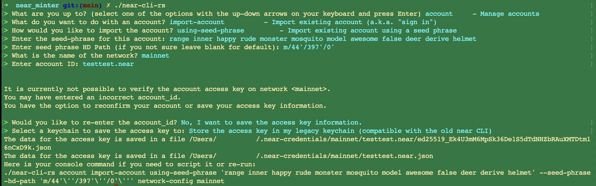

# A brief introduction and setup for `near-cli-rs`

As explained in [README.md main](../README.md) the `near-cli-rs` binary was built from [near/near-cli-rs](https://github.com/near/near-cli-rs).
Feel free to rebuild yourself by following their documentation. 

DON'T WORRY : Seed and near id used are not real! I don't own `testtest.near` nor any account attached to the seed. It's only to show you how to do. 
RECOMMENDATION : Create a wallet specifically to use it here and send only required NEAR into it! Don't use your main wallet for such dangerous ☣️  manipulation!

To initialise a new account from main directory of the repo run : 
`./near-cli-rs`

It will display :

## 1: Manage account 

Choose account. And press enter.

## 2: import-account 

 
Select import-account and press enter.

## 3: using-seed-phrase

It's what I recommend for simplicity but you are free to try other import ways. 

Obviously it's not one of my seed phrases, it's useless to try to hack me with that 🙃.

## 4: HD Path

I recommend to let default value, it's this used in every app wallet. Especially if you create your address from a wallet like [Sender Wallet](https://senderwallet.io/) or [Here wallet](https://www.herewallet.app/) it will be this path by default. So, not change it and left it blank!

 

Press enter.

## 5: Choose main network

For this repo I don't recommend testnet cause contracts are not always deployed on testnet for inscriptions. I let you delve more if you want to begin by the testnet.

Select mainnet and press enter.

## 6: Account ID

The account ID is this generated by the wallet. It looks like a hash `31c0...` if you created a fresh wallet.

Copy paste your address here and press enter.

## 7: Legacy keychain

I recommend `legacy-keychain` saving to be more flexible with script execution. If you have already selected `keychain`, remove the wallet imported and do the process again. I don't know another method but maybe it can exists.

## 8: End of process

Congratulation! 🎉 You've added your first account. 

Now, `near-cli-rs` will be able to act as the wallet you imported. 

 

On Mac it will be store into `~/.near-credentials/{hash}.json`. You will never really use it otherwise from `near-cli-rs`. 

